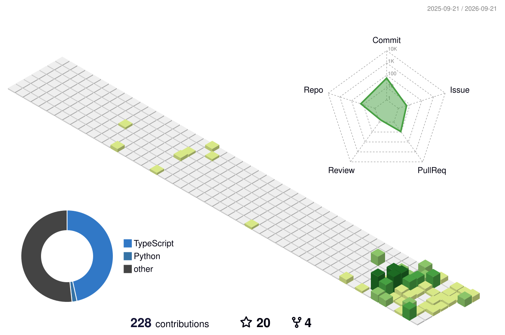

  

### ✍️ Random Dev Quote

  

## 📌 About Me
- I'm a frontend developer focused on building modern, responsive web applications.
- Currently learning React.js deeply and improving my problem-solving skills by building real projects.
- I enjoy turning ideas into clean and interactive user interfaces.

## 🧠 My Focus Areas
- Frontend Development
- React.js
- Next.js
- TypeScript
- UI/UX

## 📊 GitHub Stats & Trophies

  
  

  

  

## 🛠️ Languages & Tools

<h3 align="center">Programming Languages</h3>

  &nbsp;
  &nbsp;
  

<h3 align="center">Frontend</h3>

  &nbsp;
  &nbsp;
  &nbsp;
  &nbsp;
  

<h3 align="center">Backend</h3>

  

<h3 align="center">Database</h3>

  

<h3 align="center">DevOps & Cloud</h3>

  

<h3 align="center">Tools</h3>

  

  

## 🔗 Connect with Me

  &nbsp;
  &nbsp;
  &nbsp;
  

  

  

